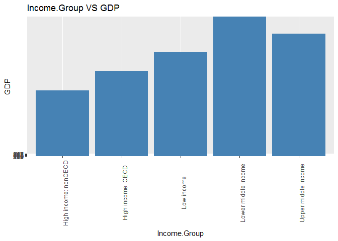

# CaseStudy01
Ghizlane Zerouali  
March 15, 2017  


# Introduction

The following project involves the reading of the relationship between the revenue monetary that is located in the gross domestic product data (GDP), and the individual income for each country which is found in the educational statistic data. The GDP is a ranking table of different countries made in 2015 that describes the monetary values for each country. The Education Statistics file holds over 4,000 internationally comparable indicators that is last updated on February 2017 and it describe education access, progression, Income, population, and expenditures. 


# Links

* Source Code and Analysis can be found in the GitHub Repository at the following link:
       https://github.com/gzerouali/CaseStudy01
       
* The Gross Domestic Product data for the 190 ranked countries in this data set:
    https://d396qusza40orc.cloudfront.net/getdata%2Fdata%2FGDP.csv 
    
* The educational data from this data set:
    https://d396qusza40orc.cloudfront.net/getdata%2Fdata%2FEDSTATS_Country.csv  
    

# Libraries 
There are some libraries that are required for this project and primarily intended to clean, tide, merge, and prepare data for analysis.

    * Library (downloader)
    * Library (plyr)
    * Library(ggplot2)
    * Library(reshape2)

# Prepare data for merging
## Downloading the data
The data are downloaded from the following websites:

```r
library(downloader)
```

```
## Warning: package 'downloader' was built under R version 3.3.3
```

```r
gdpdata <- download("https://d396qusza40orc.cloudfront.net/getdata%2Fdata%2FGDP.csv", destfile="gdpdata.csv") 
edstatsdata <- download("https://d396qusza40orc.cloudfront.net/getdata%2Fdata%2FEDSTATS_Country.csv", destfile="edstatsdata.csv")
```
Reading the data:

```r
gdp <- read.csv("gdpData.csv", stringsAsFactors = FALSE, skip = 5, nrows = 190, header = FALSE)
edstats <- read.csv("edstatsdata.csv", stringsAsFactors = F, header = TRUE)
head(gdp,10)
```

```
##     V1 V2 V3                 V4           V5 V6 V7 V8 V9 V10
## 1  USA  1 NA      United States  16,244,600     NA NA NA  NA
## 2  CHN  2 NA              China   8,227,103     NA NA NA  NA
## 3  JPN  3 NA              Japan   5,959,718     NA NA NA  NA
## 4  DEU  4 NA            Germany   3,428,131     NA NA NA  NA
## 5  FRA  5 NA             France   2,612,878     NA NA NA  NA
## 6  GBR  6 NA     United Kingdom   2,471,784     NA NA NA  NA
## 7  BRA  7 NA             Brazil   2,252,664     NA NA NA  NA
## 8  RUS  8 NA Russian Federation   2,014,775     NA NA NA  NA
## 9  ITA  9 NA              Italy   2,014,670     NA NA NA  NA
## 10 IND 10 NA              India   1,841,710     NA NA NA  NA
```

```r
tail(gdp,10)
```

```
##      V1  V2 V3                    V4    V5 V6 V7 V8 V9 V10
## 181 WSM 181 NA                 Samoa  684     NA NA NA  NA
## 182 COM 182 NA               Comoros  596     NA NA NA  NA
## 183 DMA 183 NA              Dominica  480     NA NA NA  NA
## 184 TON 184 NA                 Tonga  472     NA NA NA  NA
## 185 FSM 185 NA Micronesia, Fed. Sts.  326     NA NA NA  NA
## 186 STP 186 NA São Tomé and Principe  263     NA NA NA  NA
## 187 PLW 187 NA                 Palau  228     NA NA NA  NA
## 188 MHL 188 NA      Marshall Islands  182     NA NA NA  NA
## 189 KIR 189 NA              Kiribati  175     NA NA NA  NA
## 190 TUV 190 NA                Tuvalu   40     NA NA NA  NA
```

## Cleaning and tidying the data
The gross domestic product data needs to remove regions from it and keep only countries.

```r
gdp1 <- gdp[1:190,]
```

Apply the clonames to change the columns title and tide the data, convert GDP values to numeric. Tide the education statistic data set by country code and income group.

```r
names(gdp)
```

```
##  [1] "V1"  "V2"  "V3"  "V4"  "V5"  "V6"  "V7"  "V8"  "V9"  "V10"
```

```r
colnames(gdp) <- c("CountryCode", "GDP_Rank", "V3", "CountryName", "GDP","V6", "V7", "V8", "V9", "V10")
colnames(gdp)
```

```
##  [1] "CountryCode" "GDP_Rank"    "V3"          "CountryName" "GDP"        
##  [6] "V6"          "V7"          "V8"          "V9"          "V10"
```

```r
gdp <- subset(gdp, select = c("CountryCode", "GDP_Rank", "CountryName", "GDP"))
names(gdp)
```

```
## [1] "CountryCode" "GDP_Rank"    "CountryName" "GDP"
```

```r
gdp$GDP_Rank <- as.numeric(gdp$GDP_Rank)
gdp$GDP <- as.numeric(gdp$GDP)
```

```
## Warning: NAs introduced by coercion
```

```r
str(gdp)
```

```
## 'data.frame':	190 obs. of  4 variables:
##  $ CountryCode: chr  "USA" "CHN" "JPN" "DEU" ...
##  $ GDP_Rank   : num  1 2 3 4 5 6 7 8 9 10 ...
##  $ CountryName: chr  "United States" "China" "Japan" "Germany" ...
##  $ GDP        : num  NA NA NA NA NA NA NA NA NA NA ...
```

```r
edstats <- subset(edstats, select = c("CountryCode", "Income.Group"))
names(edstats)
```

```
## [1] "CountryCode"  "Income.Group"
```

Remove entries with no abreviation and remove comma "," to allow coercion.

```r
gdp <- gdp[gdp$CountryCode !="", ]
gdp$GDP <- gsub(",", "", gdp$GDP)
```

# The merge
Merge the gross domestic product data set and the education statistic set based on the country shortcode.

```r
gdp.edstats <- merge(edstats, gdp, by="CountryCode")
names(gdp.edstats)
```

```
## [1] "CountryCode"  "Income.Group" "GDP_Rank"     "CountryName" 
## [5] "GDP"
```

# Matched ID 
The dimension of the merged data helps to find the number of how many matched countries.

```r
dim(gdp.edstats)
```

```
## [1] 189   5
```

```r
sum(is.na(gdp.edstats))
```

```
## [1] 173
```
After merging the two data sets by country code, the number of 189 present the number of matched IDs in the data frame. 

# Sorting the data
Sort the data frame in descending order by GDP so United States is last.

```r
library(plyr)
gdp.edstats <- arrange(gdp.edstats, desc(GDP_Rank))
head(gdp.edstats)
```

```
##   CountryCode        Income.Group GDP_Rank           CountryName GDP
## 1         TUV Lower middle income      190                Tuvalu  40
## 2         KIR Lower middle income      189              Kiribati 175
## 3         MHL Lower middle income      188      Marshall Islands 182
## 4         PLW Upper middle income      187                 Palau 228
## 5         STP Lower middle income      186 São Tomé and Principe 263
## 6         FSM Lower middle income      185 Micronesia, Fed. Sts. 326
```

```r
arrange(gdp.edstats, desc(GDP_Rank))[13, ]
```

```
##    CountryCode        Income.Group GDP_Rank         CountryName GDP
## 13         KNA Upper middle income      178 St. Kitts and Nevis 767
```
The 13th country in the resulting data frame is “St. Kitts and Nevis”.

# The average
The average GDP rankings for the "High income: OECD" and "High income: nonOECD" groups.

```r
average1 <- mean(subset(gdp.edstats, Income.Group %in% "High income: OECD", select = c(GDP_Rank))$GDP_Rank)
average2 <- mean(subset(gdp.edstats, Income.Group %in% "High income: nonOECD", select = c(GDP_Rank))$GDP_Rank)
average <- c(average1, average2)
average
```

```
## [1] 32.96667 91.91304
```

# The plot
The distribution of GDP value for all the countries by income group. 

```r
library(ggplot2)
ggplot(gdp.edstats,aes(y=GDP, x=Income.Group))+ labs(title="Income.Group VS GDP")+geom_bar(stat="identity", fill="steelblue")+xlab("Income.Group")+ylab("GDP")+theme( axis.text.x=element_text(angle=90))
```

<!-- -->

# Summary
To conclude, the plot of the distribution of GDP value by income group for all the countries shows a strong association between the two variables. The GDP for the lower middle income countries is clearly higher than the other income countries groups. And also the average GDP rankings for the "High income: OECD" is less than the "High income: nonOECD" groups.

# Table
Make a table in depend of income group by deviding the GDP ranking into 5 separate quantile groups, to see How many countries are Lower middle income among the 38 nations with highest GDP.

```r
breaks <- quantile(gdp.edstats$GDP_Rank,seq(0, 1, 0.2))
head(cut(gdp.edstats$GDP_Rank, breaks = breaks))
```

```
## [1] (152,190] (152,190] (152,190] (152,190] (152,190] (152,190]
## Levels: (1,38.6] (38.6,76.2] (76.2,114] (114,152] (152,190]
```

```r
gdp.edstats$quantile <- cut(gdp.edstats$GDP_Rank, breaks=breaks)
table(gdp.edstats$Income.Group, gdp.edstats$quantile)
```

```
##                       
##                        (1,38.6] (38.6,76.2] (76.2,114] (114,152] (152,190]
##   High income: nonOECD        4           5          8         4         2
##   High income: OECD          17          10          1         1         0
##   Low income                  0           1          9        16        11
##   Lower middle income         5          13         11         9        16
##   Upper middle income        11           9          8         8         9
```

# References

[1] http://www.statmethods.net/management/sorting.html

[2] http://www.statmethods.net/advgraphs/ggplot2.html

[3] http://vita.had.co.nz/papers/tidy-data.pdf

[4] https://cran.r-project.org/web/packages/tidyr/vignettes/tidy-data.html

[5] http://rmarkdown.rstudio.com/articles_intro.html

